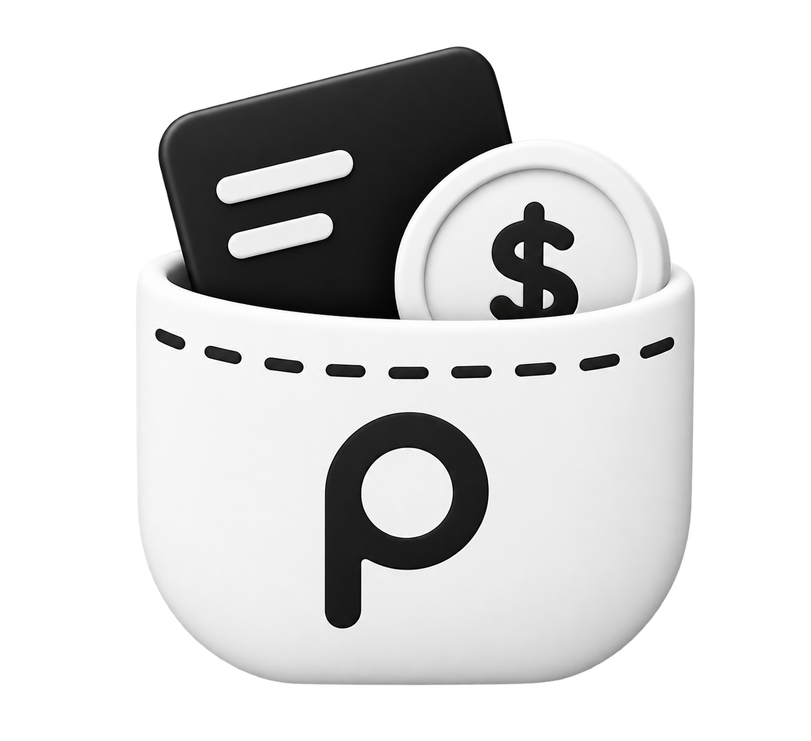

<p align="center">
  
</p>

<h1 align="center">Pocketly — Smart Multi-Currency Financial Tracker</h1>

<p align="center">
  <strong>A modern, privacy-first personal finance application with real-time multi-currency support, investment portfolio tracking, debt reconciliation, intelligent recurring bills, OCR receipt scanning, and full universal audit logs.</strong>
</p>

<p align="center">
  <a href="#overview">Overview</a> •
  <a href="#key-features">Key Features</a> •
  <a href="#tech-stack">Tech Stack</a> •
  <a href="#database-architecture">Database Architecture</a> •
  <a href="#getting-started">Getting Started</a> •
  <a href="#project-structure">Project Structure</a> •
  <a href="#license">License</a>
</p>

<p align="center">
  
  
  
  
  
  
</p>

---

## Overview

**Pocketly** is an end-to-end financial companion engineered for individuals, freelancers, and global travelers who handle multiple bank accounts, e-wallets, and foreign currencies (IDR, USD, SGD, EUR, JPY, GBP, etc.).

Built with **Next.js 16 App Router**, **Supabase (PostgreSQL with Row Level Security & Triggers)**, and **Tailwind CSS 4**, Pocketly provides complete transparency over your financial life with bank-grade auditability and instant liquidity insights.

---

## Key Features

### 1. Account & Multi-Wallet Liquidity
* **Unlimited Wallets**: Manage Bank Accounts, Cash Wallets, E-Wallets, Credit Cards, and Investment RDNs.
* **1-Tap Pinned Presets (Fast Logging)**: Pin frequent transactions (coffee, fuel, daily commute) to the dashboard for 1-second 1-tap recording.
* **Auto-Balance Calculation & Physical Reconciliation**: Database triggers compute realtime current balances. Use the 1-click **Adjust Balance (Sesuaikan Saldo)** feature to seamlessly reconcile Pocketly with physical bank balances via the Discrepancy category.
* **Inter-Account Transfers & Smart Natural Forex**: Move funds between wallets with pre-filled source accounts, natural human-friendly forex rates (`1 SGD = Rp 12,000` / `1 USD = Rp 16,200`), two-way real-time calculations, optional admin fees, and interactive mutation details.

### 2. Real-Time Multi-Currency Engine
* **Native & Global Currencies**: Transact in IDR, USD, and SGD with precision floating-point conversions.
* **Live Exchange Rates**: Automated currency conversions for global net-worth computation and consolidated reporting.
* **Dynamic Display Switcher**: Toggle preferred base currency on the fly across the entire dashboard.

### 3. Analytics & Interactive Cashflow Charts
* **Income vs. Expense Analytics**: Visual breakdown of your monthly cash flow with interactive charts.
* **Category Breakdown**: Granular spending insights with customizable icons and color palettes.
* **Net Worth Progression**: Historical tracking of total assets and liabilities over customizable periods.

### 4. Investment Portfolio & Stock Trades
* **Holdings Tracking**: Track equities, mutual funds, and crypto balances with average buy price and realized gains.
* **Integrated Cash Accounts**: Buy/Sell transactions directly debited or credited to dedicated RDN / bank wallets.

### 5. Savings Goals & Deposit Allocation
* **Milestone Tracking**: Set target amounts and target dates for dream purchases, emergency funds, or vacations.
* **Smart Allocations**: Deposit funds directly into savings goals with linked source wallets.

### 6. Recurring Transactions & Due Date Center
* **Automated Bill Reminders**: Never miss subscription renewals, utility bills, or salary disbursements.
* **Flexible Schedules**: Daily, weekly, monthly, quarterly, and annual recurrences with auto-execution.
* **Unified Due Center**: Compact banner and dedicated management view for upcoming bills and debt maturities.

### 7. Debt & Receivable Management (Hutang & Piutang)
* **Borrow & Lend Tracking**: Track who owes you money and who you owe with full installment logs.
* **Currency-Matched Account Filter & Balance Sync**: Disbursement/receipt accounts automatically match the selected currency with optional immediate cash balance debiting/crediting.
* **Compact & Flexible Interface**: Streamlined type switchers (`Payables` / `Receivables`) and versatile free-text notes.

### 8. Intelligent Receipt OCR Scanner
* **Camera / Upload Scanning**: Upload photos or PDFs of physical receipts.
* **Auto-Extraction**: Automatically extracts merchant name, date, itemized list, and total amount.

### 9. Universal Audit Trail & Privacy Mode
* **Complete Audit Log**: Every creation, update, and deletion is recorded immutably via PostgreSQL triggers.
* **Masking Privacy Mode**: Quick toggle to blur sensitive balance amounts in public spaces.

### 10. Advanced Financial Reports & CSV Export
* **Custom Date Ranges**: Filter by date range, account, type, or category.
* **Instant Export**: Download structured CSV and financial summaries ready for spreadsheet analysis.

### 11. Progressive Web App (PWA) & Mobile-First Experience
* **Installable Application**: Install Pocketly directly onto iOS, Android, macOS, and Windows without app store downloads.
* **Standalone Experience**: Runs full-screen with native app feel, smooth touch gestures, and instant launch.

---

## Installation as PWA (iOS & Android)

Pocketly is built as a Progressive Web App (PWA), meaning you can install it directly to your home screen with a standalone app experience:

### iOS (iPhone & iPad)
1. Open your deployed Pocketly URL in **Safari**.
2. Tap the **Share** button (the square with an arrow pointing up at the bottom toolbar).
3. Scroll down and tap **Add to Home Screen** (`Tambahkan ke Layar Utama`).
4. Tap **Add** in the top right corner. Pocketly will now appear on your Home Screen like a native app.

### Android
1. Open your deployed Pocketly URL in **Google Chrome**.
2. Tap the **three dots menu** (`⋮`) in the top right corner (or tap the **Install app** prompt banner if shown).
3. Tap **Install app** or **Add to Home screen** (`Instal aplikasi` / `Tambahkan ke layar utama`).
4. Follow the prompt to confirm installation. Pocketly will be added to your app drawer and home screen.

### Desktop (Chrome / Edge / Brave)
1. Open the website in your browser.
2. Click the **Install Pocketly** icon in the address bar (or browser menu -> Apps -> Install Pocketly).

---

## Tech Stack

| Layer | Technologies |
| :--- | :--- |
| **Framework** | Next.js 16 (App Router, Server Actions, React Server Components) |
| **Language** | TypeScript 5 (Strict Mode) |
| **Styling & UI** | Tailwind CSS 4, Lucide React Icons, Radix UI Primitives |
| **Database & Auth** | Supabase (PostgreSQL, Row Level Security, Triggers & PL/pgSQL) |
| **Validation** | Zod 4 |
| **OCR & AI** | Tesseract.js 7 / Google Gemini Vision API |

---

## Project Structure

```
pocketly/
├── public/                     # Static assets, logos, and report templates
├── src/
│   ├── actions/                # Next.js Server Actions (Transactions, Accounts, Goals, etc.)
│   ├── app/                    # Next.js 16 App Router pages & layouts
│   │   ├── (auth)/             # Authentication routes (Login, Signup, Reset Password)
│   │   └── (main)/             # Main application views (Dashboard, Accounts, Analytics, etc.)
│   ├── components/             # Reusable UI components & feature modules
│   │   ├── accounts/           # Account management & transfer modals
│   │   ├── dashboard/          # Summary cards, charts, and due banners
│   │   ├── debts/              # Debt & receivable views and payment sheets
│   │   ├── goals/              # Savings goals tracker and deposit dialogs
│   │   ├── investments/        # Stock holdings and trade forms
│   │   ├── layout/             # Top navbar, bottom navigation, and quick-add sheet
│   │   ├── recurring/          # Recurring transaction modals and banners
│   │   ├── reports/            # Financial reporting and CSV export
│   │   └── transactions/       # Transaction lists, cards, and filter sheets
│   ├── lib/                    # Core utilities, Supabase client, i18n, validations
│   └── types/                  # Database schemas and TypeScript type definitions
├── supabase/
│   └── migrations/             # Full PostgreSQL schema migrations & trigger scripts
└── package.json
```

---

## Getting Started

### Prerequisites
* **Node.js** `>= 18.18.0`
* **npm**, **pnpm**, or **yarn**
* A free Supabase project

### 1. Clone Repository
```bash
git clone https://github.com/GabrielNathanael/pocketly-financial-tracker.git
cd pocketly-financial-tracker
```

### 2. Install Dependencies
```bash
npm install
```

### 3. Setup Environment Variables
Create a `.env.local` file in the project root:
```env
NEXT_PUBLIC_SUPABASE_URL=https://your-project-id.supabase.co
NEXT_PUBLIC_SUPABASE_ANON_KEY=your-anon-key
SUPABASE_SERVICE_ROLE_KEY=your-service-role-key

# Optional for OCR receipt scanning
GEMINI_API_KEY=your-gemini-api-key
```

### 4. Run Database Migrations
Execute the SQL migrations found in `supabase/migrations/` in order within your Supabase SQL Editor:
1. `001_initial_schema.sql`
2. `002_multi_currency_support.sql`
3. `003_multi_currency_budgets.sql`
4. `004_universal_audit_triggers.sql`
5. `005_fix_universal_audit_trigger.sql`
6. `006_recurring_transactions.sql`
7. `007_savings_goals.sql`
8. `008_transaction_tags.sql`
9. `009_fix_audit_trigger_user_id.sql`
10. `010_investments_support.sql`

### 5. Launch Development Server
```bash
npm run dev
```
Open [http://localhost:3000](http://localhost:3000) in your browser.

---

## License

This project is open-sourced under the [MIT License](LICENSE).

Copyright &copy; 2026 [Gabriel Nathanael](https://github.com/GabrielNathanael).
